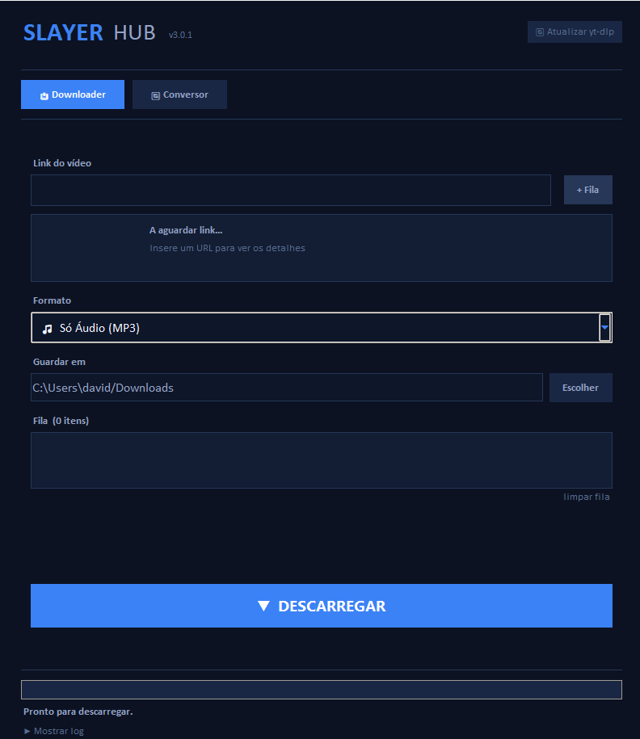
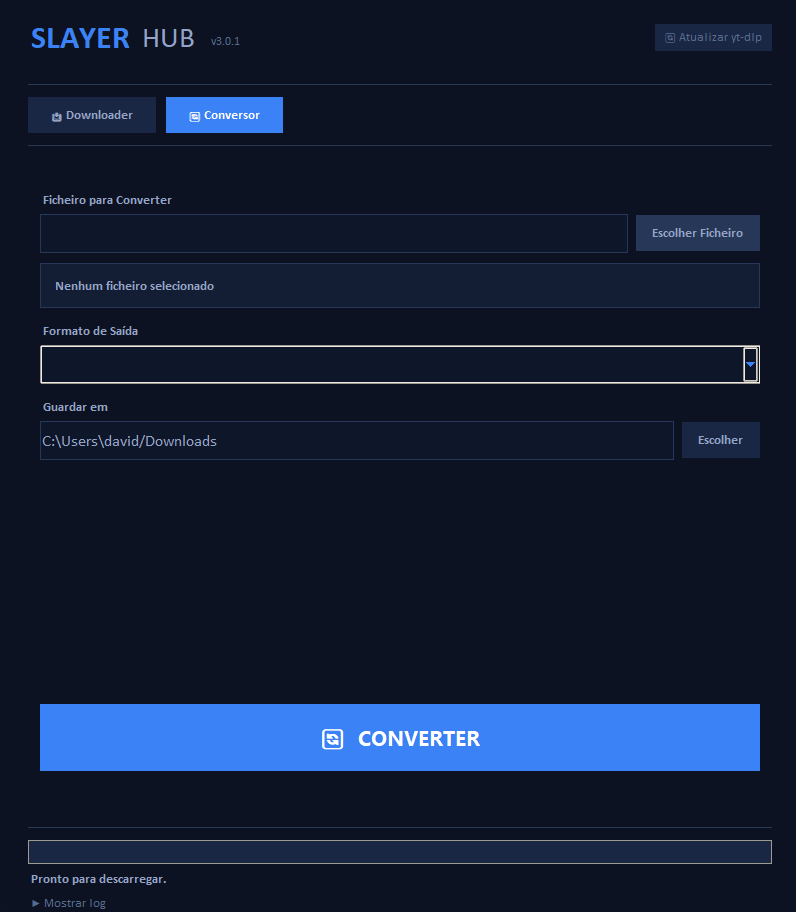

# 🗡️ SlayerHub — Downloader & Conversor

[](https://github.com/TheSlayer999/SlayerHub/releases)
[](https://www.python.org/)
[](LICENSE)
[](https://github.com/TheSlayer999/SlayerHub)
[](https://github.com/yt-dlp/yt-dlp)

**SlayerHub** é uma aplicação desktop multiplataforma (Windows e macOS), construída em Python com Tkinter, que permite descarregar vídeos e áudio de dezenas de plataformas online e converter ficheiros de media entre formatos — tudo com uma interface gráfica limpa e totalmente otimizada.

---

## Índice

- [Funcionalidades](#funcionalidades)
  - [Downloader](#-downloader)
  - [Conversor](#-conversor)
- [Capturas de Ecrã](#capturas-de-ecrã)
- [Formatos de Download](#formatos-de-download)
- [Plataformas Suportadas](#plataformas-suportadas)
- [Instalação](#instalação)
- [Compilar para .exe](#compilar-para-exe)
- [Para Programadores](#para-programadores)
- [Changelog](#changelog)
- [Licença](#licença)

---

## Funcionalidades

### 📥 Downloader

A aba **Downloader** permite colar links de vídeo/áudio, escolher formato e qualidade, e fazer download individual ou em fila.

- **Detecção automática de plataforma** — Identifica YouTube, TikTok, Instagram, Twitter/X, Vimeo e SoundCloud ao colar o link.
- **Pré-visualização do vídeo** — Mostra miniatura, título, canal e duração antes de descarregar.
- **Colagem automática** — Cola o URL do clipboard ao abrir ou focar a janela (se o campo estiver vazio).
- **Fila de downloads** — Adiciona múltiplos links e inicia todos com um único clique. Cada item tem botão de remoção individual.
- **Cancelamento a quente** — O botão de download transforma-se em "Cancelar" durante o processo.
- **Notificação sonora** — Emite beep nativo do Windows ao concluir.
- **Abrir pasta** — Botão de atalho para a pasta de destino aparece após cada download.
- **Log em tempo real** — Console expansível com progresso, velocidade, ETA e erros detalhados.
- **Atualizar yt-dlp** — Botão no cabeçalho que descarrega a versão mais recente do motor diretamente do GitHub.
- **FFmpeg automático** — Se o FFmpeg não for encontrado, a app oferece-se para o descarregar e instalar automaticamente (~100 MB).

### 🔄 Conversor

A aba **Conversor** permite transformar ficheiros entre formatos de vídeo, áudio e imagem.

- **Vídeo para vídeo** — MP4, MKV, AVI, WEBM
- **Vídeo para áudio** — Extrai MP3, WAV, AAC de qualquer vídeo
- **Áudio para áudio** — MP3, WAV, AAC, FLAC, OGG
- **Imagem para imagem** — PNG, JPG, WEBP, BMP, ICO (via Pillow)
- **Suporte a HEIC/HEIF** — Converte fotos de iPhone para outros formatos (requer `pillow-heif`)
- **Batch conversion** — Seleciona múltiplos ficheiros de uma vez
- **Barra de progresso precisa** — Usa `ffprobe` para calcular a percentagem real durante a conversão

---

## Capturas de Ecrã

| Aba Downloader | Aba Conversor |
|---|---|
|  |  |

---

## 🎯 Formatos de Download

| Formato | Tipo | Qualidade |
|---------|------|-----------|
| 🎵 **Só Áudio (MP3)** | Áudio | 320 kbps |
| 🎬 **Vídeo 720p** | Vídeo MP4 | HD |
| 🎬 **Vídeo 1080p** | Vídeo MP4 | Full HD |
| ⭐ **Melhor Qualidade** | Vídeo MP4 | Máxima disponível |

---

## 🌐 Plataformas Suportadas

Qualquer site suportado pelo **yt-dlp** funciona, incluindo:

`YouTube` · `TikTok` · `Instagram` · `Twitter / X` · `Vimeo` · `SoundCloud` · e [muitos mais](https://github.com/yt-dlp/yt-dlp/blob/master/supportedsites.md)

A app deteta automaticamente a plataforma ao colar o link e apresenta a pré-visualização antes do download.

---

## 📥 Instalação

### Opção 1 — Executável pronto (recomendado)

1. Vai à secção **[Releases](https://github.com/TheSlayer999/SlayerHub/releases)** do repositório.
2. Descarrega o ficheiro referente ao teu sistema: `SlayerHubWin.zip` (Windows) ou `SlayerHubMac.dmg` (Mac).
3. **No Windows:** Extrai o ficheiro `.zip` e abre `SlayerHub.exe`.
   **No Mac:** Abre o ficheiro `.dmg` e arrasta a aplicação `SlayerHub.app` para a pasta Aplicações (ou abre-a diretamente).

> ⚠️ **Windows:** O Windows pode bloquear o `.exe` por não estar assinado. Clica em **"Mais informações" → "Executar mesmo assim"**.
> 🍎 **macOS:** O Mac pode bloquear o `.app`. Vai a **Definições de Sistema → Privacidade e Segurança** e clica em **"Abrir na mesma"**.

A pasta final contém apenas o executável da aplicação:

```
SlayerHub/
└── SlayerHub.exe / SlayerHub.app   # Aplicação completa
```

> O FFmpeg é descarregado automaticamente pela app na primeira vez que for necessário.

### Opção 2 — A partir do código-fonte

```bash
git clone https://github.com/TheSlayer999/SlayerHub.git
cd SlayerHub
pip install -r requirements.txt
python downloader.py
```

> Em modo script, o FFmpeg é descarregado automaticamente se não for encontrado. Podes também colocá-lo na pasta do projeto ou tê-lo instalado no PATH do sistema.

---

## 🔨 Compilar (Para Windows e Mac)

**Para Windows (.exe):**
O script `build.bat` automatiza todo o processo.
```bat
build.bat
```

**Para macOS (.dmg):**
No terminal do Mac, corre o script `build_mac.sh` (garante que instalaste o `requirements.txt`):
```bash
chmod +x build_mac.sh
./build_mac.sh
```

O que acontece automaticamente:
1. Compila o `downloader.py` num executável ou `.app` único com PyInstaller.
2. Cria os resultados na pasta `dist/` prontos a distribuir.

> O FFmpeg **não** é incluído no pacote — a app descarrega-o automaticamente para o formato certo (Windows ou Mac) na primeira execução, se necessário. A pasta final pode ser partilhada diretamente.

---

## 🛠️ Para Programadores

### Tech Stack

| Tecnologia | Finalidade |
|------------|------------|
| **Python 3.10+** | Linguagem principal |
| **Tkinter (ttk)** | Interface gráfica nativa |
| **yt-dlp** | Motor de download (YouTube, TikTok, etc.) |
| **FFmpeg** | Merge de vídeo/áudio e conversão |
| **Pillow** | Miniaturas e conversão de imagens |
| **pillow-heif** | Suporte a fotos HEIC/HEIF (iPhone) |
| **PyInstaller** | Compilação para `.exe` |
| **argparse** | Parsing de argumentos da CLI |

### Requisitos

| Dependência | Função | Obrigatório |
|-------------|--------|-------------|
| **Python 3.10+** | Runtime | ✅ |
| **yt-dlp** | Motor de download | ✅ |
| **FFmpeg** | Merge de vídeo/áudio, conversão | ✅ |
| **Pillow** | Miniaturas e conversão de imagens | ⚠️ Recomendado |
| **pillow-heif** | Suporte a HEIC/HEIF (iPhone) | ⚠️ Opcional |

### Estrutura do Projeto

```
SlayerHub/
├── downloader.py           # Código principal — UI (Tkinter) + lógica de download/conversão
├── requirements.txt        # Dependências Python
├── build.bat               # Script de compilação (PyInstaller)
├── assets/
│   └── icon.ico            # Ícone da aplicação
└── LICENSE                 # Licença MIT
```

### Arquitetura Interna

O código está organizado em 4 classes principais, dentro de um único ficheiro (`downloader.py`):

| Classe | Responsabilidade |
|--------|-----------------|
| `ConfigManager` | Leitura/escrita de `config.json` (pasta de destino, formato, visibilidade do log) |
| `QueueManager` | Gestão da lista de downloads em lote |
| `DownloadEngine` | Execução do `yt-dlp` em subprocesso; parsing de progresso, velocidade e erros |
| `PulsarUI` | Interface Tkinter completa com abas Downloader e Conversor |

---

## 📋 Changelog

Consulta todas as notas de versões detalhadas na página [Releases do GitHub](https://github.com/TheSlayer999/SlayerHub/releases).

---

## 📄 Licença

Este projeto está licenciado sob a **MIT License** — vê o ficheiro [`LICENSE`](LICENSE) para mais detalhes.

